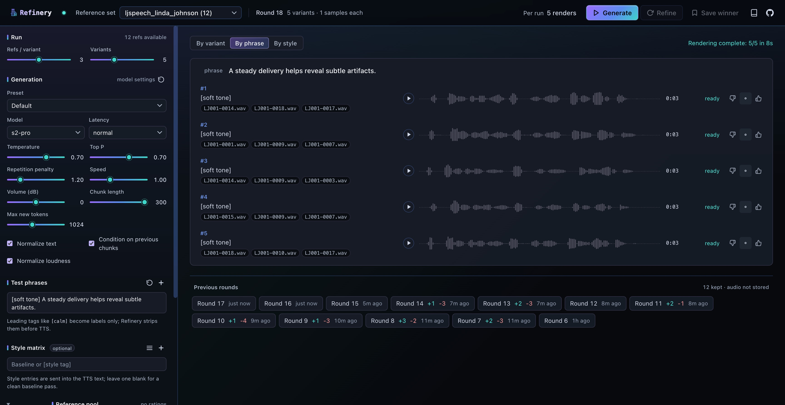

[](https://mikeharty.com/refinery/)
[](https://github.com/mikeharty/refinery/actions/workflows/ci.yml)
[](LICENSE)
[](https://www.python.org/downloads/release/python-3110/)

Refinery helps find the best reference clip combinations for cloning a voice with [Fish Audio](https://fish.audio/) and [Fish-Speech](https://github.com/fishaudio/fish-speech) voice cloning models.

Refinery uses an intuitive, human-in-the-loop iterative process: it generates candidate ref combinations, renders them against the same phrases/styles, lets you favorite the best outputs, and then biases the next round toward those refs.

<a href="https://mikeharty.com/refinery/">
  
</a>

## Demo

Same speaker (the bundled public-domain LJSpeech voice), same phrase, same model — only the reference combination differs between rounds. Listen to round 1 (naive random pick) versus round 3 (refined favorite-weighted pick) on the [project site](https://mikeharty.com/refinery/#listen).

## Features

- Random K-of-N ref search
- Favorite-weighted refinement
- Side-by-side audio comparison
- Customizable test phrases
- Bracket-style prompt matrix (S2 tags)
- Model, latency, sampling, prosody, chunk, and long-form controls
- In-memory TTS cache
- JSON recipe export

## Requirements

Python 3.11+ with `uv` and/or Docker Compose.

## Setup

Clone and create a local env file:

```bash
git clone https://github.com/mikeharty/refinery.git
cd refinery
cp .env.example .env
```

## Configuration

| Variable                       | Default                          | Used by         | Notes                                               |
| ------------------------------ | -------------------------------- | --------------- | --------------------------------------------------- |
| `REFERENCE_ROOT`               | `./refs`                         | Native Refinery | Reference-set root                                  |
| `FISH_TTS_URL`                 | `http://127.0.0.1:8080/v1/tts`   | Native Refinery | Fish-Speech or hosted Fish Audio endpoint           |
| `REFINERY_FISH_TTS_URL`        | `http://fish-speech:8080/v1/tts` | Docker Refinery | Use `host.docker.internal` for host-run Fish-Speech |
| `FISH_API_KEY`                 | unset                            | Both            | Optional bearer token                               |
| `FISH_MODEL`                   | `s2-pro`                         | Both            | Model header sent with TTS requests                 |
| `FISH_TTS_TIMEOUT_SECONDS`     | `0`                              | Both            | Generation/read timeout; `0` waits indefinitely     |
| `FISH_CONNECT_TIMEOUT_SECONDS` | `10`                             | Both            | Connect timeout for unreachable Fish endpoints      |
| `MAX_TTS_CACHE_ITEMS`          | `256`                            | Both            | Set `0` to disable in-memory audio cache            |
| `PORT`                         | `5055`                           | Native Refinery | Web UI port for `python app.py`                     |
| `REFINERY_PORT`                | `5055`                           | Docker Refinery | Host port mapped to container port `5055`           |

See [.env.example](.env.example) for more options and details.

## Backends

You can choose between hosted Fish Audio or self-hosted Fish-Speech. The latter can run in Docker or natively on Apple Silicon.

| Backend                  | Use when                                       | Endpoint                                        |
| ------------------------ | ---------------------------------------------- | ----------------------------------------------- |
| Hosted Fish Audio        | You have an API key and want the simplest path | `https://api.fish.audio/v1/tts`                 |
| Docker Fish-Speech       | Linux/WSL with NVIDIA CUDA                     | `http://fish-speech:8080/v1/tts` inside Compose |
| Native macOS Fish-Speech | Apple Silicon with MPS                         | `http://127.0.0.1:8080/v1/tts`                  |

### Hosted Fish Audio

Set both URLs if you may run Refinery either natively or in Docker:

```bash
FISH_TTS_URL=https://api.fish.audio/v1/tts
REFINERY_FISH_TTS_URL=https://api.fish.audio/v1/tts
FISH_API_KEY=your_api_key_here
FISH_MODEL=s2-pro
```

`FISH_TTS_URL` is used by native Python runs. `REFINERY_FISH_TTS_URL` is used by the Refinery container.

### Docker Fish-Speech

For Linux/WSL with a CUDA-capable NVIDIA GPU.

Local S2-Pro inference is heavy; Fish's docs currently recommend at least 24GB VRAM.

```bash
docker compose --profile download run --rm fish-models
docker compose --profile fish up --build
```

This downloads `fishaudio/s2-pro` into `./fish-checkpoints/s2-pro`, starts Fish-Speech on port `8080`, and starts Refinery on port `5055`.

To run only Fish-Speech in Docker and run Refinery natively:

```bash
docker compose --profile fish up fish-speech
```

Keep the native endpoint in `.env`:

```bash
FISH_TTS_URL=http://127.0.0.1:8080/v1/tts
```

### Apple Silicon macOS + MPS

Docker Desktop on macOS does not expose Apple Metal/MPS to Linux containers. On Apple Silicon, use the project-local native scripts:

```bash
scripts/install-fish-macos.sh --install-brew-deps
scripts/start-fish-macos.sh
```

The installer clones Fish-Speech into `.local/fish-speech`, installs with `uv`, and downloads `fishaudio/s2-pro` into that project-local directory. The `--install-brew-deps` flag installs missing native audio dependencies (`ffmpeg`, `sox`, and `portaudio`) with Homebrew; omit it if you already have them. It does not touch global Fish-Speech clones or system Python environments.

Useful install/start options:

```bash
scripts/install-fish-macos.sh --update
FISH_SPEECH_API_PORT=8081 scripts/start-fish-macos.sh
scripts/start-fish-macos.sh --cpu
scripts/start-fish-macos.sh --no-half
FISH_SPEECH_EXTRA_ARGS="--workers 1" scripts/start-fish-macos.sh
```

Remove only the project-local Fish-Speech install:

```bash
scripts/uninstall-fish-macos.sh
```

The uninstaller removes only the project-local Fish-Speech install.

## Running Refinery

Native:

```bash
uv sync
uv run uvicorn app:app --host 0.0.0.0 --port 5055 --reload
```

Docker:

```bash
docker compose up --build refinery
```

When the Refinery container talks to a Fish-Speech server running directly on your host:

```bash
REFINERY_FISH_TTS_URL=http://host.docker.internal:8080/v1/tts
```

Open [http://localhost:5055](http://localhost:5055).

## Reference Audio

Each reference set is any folder under `refs/` that directly contains paired `.wav` and `.lab` files:

```text
refs/
  ljspeech_linda_johnson/
    LJ001-0001.wav
    LJ001-0001.lab
    LJ001-0003.wav
    LJ001-0003.lab
  my_voice/
    clip_01.wav
    clip_01.lab
  bender-moods/
    angry/
      angry_01.wav
      angry_01.lab
    tired/
      tired_01.wav
      tired_01.lab
```

Rules:

- `.lab` must contain the exact transcript for its paired `.wav`.
- Nested folders are supported. A grouping folder such as `refs/bender-moods/` does not need clips of its own; each mood folder below it appears as a selectable reference set such as `bender-moods/angry`.
- Mood folders are not merged into one parent pool. Choose one mood set at a time from the reference-set picker.
- Local audio and `.lab` transcript files are ignored by git so private refs are not committed accidentally.
- `refs/ljspeech_linda_johnson` is bundled public-domain sample material from [The LJ Speech Dataset](https://keithito.com/LJ-Speech-Dataset/).
- Only use voices you have permission to clone.

Fish S2 style tags are useful for prompting, but they are not always enough. If a cloned voice becomes unstable, loses the original speaker, or turns cartoonish when asked for a mood, use mood-specific reference sets instead: group clips by the same original speaker in that actual mood, then let Refinery search combinations inside that folder. The tag can still describe the desired delivery, but the refs carry the acoustic evidence.

### Transcribing `.lab` files

For reference clips that do not already have trusted transcripts, use the batch transcription script. It scans `.wav` files by default because Refinery loads `.wav`/`.lab` pairs, writes each transcript to the matching `.lab`, and stores backups plus a JSONL manifest under `output/transcriptions/`.

Preview the files that would be processed:

```bash
scripts/transcribe-ref-labs-local.sh refs/my_voice --dry-run
```

The local wrapper installs what it needs on first run. On Apple Silicon macOS it uses `mlx-whisper`; elsewhere it uses `faster-whisper`. Local transcription is free after the model download and keeps audio on your machine. Local providers default to large Whisper models.

Run local speech-to-text:

```bash
scripts/transcribe-ref-labs-local.sh refs/my_voice --language en
```

Override the local model when you want a different quality/runtime tradeoff:

```bash
scripts/transcribe-ref-labs-local.sh refs/my_voice --language en --mlx-model mlx-community/whisper-small.en-mlx
scripts/transcribe-ref-labs-local.sh refs/my_voice --language en --provider faster-whisper --local-model medium.en
```

OpenAI transcription is available as an equivalent hosted provider:

```bash
OPENAI_API_KEY=your_api_key_here uv run python scripts/transcribe_ref_labs.py refs/my_voice --provider openai --language en
```

The underlying Python script still supports `--provider auto`, `--provider faster-whisper`, `--provider mlx-whisper`, `--provider whisper-cli`, and `--provider openai`. Use `--missing-only` to fill only missing labels or `--limit 5` for a small trial run.

## Test Phrases

Edit `texts.json` or use the UI.

```json
["Your first test phrase here.", "Another phrase to compare voices with.", "A third phrase for good measure."]
```

Keep phrase and style counts small when using a paid endpoint. Refinery renders every variant against every phrase/style combination.

## Refinement Process

Generate variants:

1. Load `.wav`/`.lab` pairs from the selected reference set.
2. Create random K-of-N reference combinations.
3. Expand phrases across optional S2 style tags.
4. Render audio for each variant/sample pair.

Refine:

1. Give references from favorited variants 2x selection weight.
2. Ensure at least half of new variants include a favorited reference.

Repeat until the best combination is clear enough to export.

Recipe export and caching make it easy to compare future ranking approaches, pairwise scoring, or audio-quality preflight checks.

## Contributing

Contributions are welcome!

Start with [CONTRIBUTING.md](CONTRIBUTING.md).

Security reports should follow [SECURITY.md](SECURITY.md).

Release steps live in [docs/RELEASE_CHECKLIST.md](docs/RELEASE_CHECKLIST.md).

Community visibility notes live in [docs/OSS_LAUNCH.md](docs/OSS_LAUNCH.md).

If you use Refinery in research, cite it via [CITATION.cff](CITATION.cff).

## License

[MIT](LICENSE)
